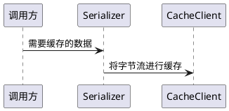

# 引言

每一个项目在交付落地的时候都有可能需要兼容公司内部的一系列组件(无论是真实使用还是处于某些其它原因)。而此时仅仅使用spring-redis组件可能就造成大量的代码修改工作。
对此，本工程抽象一个更为上层的，基本基于redis的缓存操作接口，使得真实交付场景下，需要修改底层缓存客户端时，由这个接口承担桥梁，降低定制化开发工作量

# CacheClient

客户端层面的根接口，用于无差别的实现一些缓存的基本客户端级别的操作，是向下对接缓存的关键接口

对业务层面的根接口，有点类似于RedisTemplate，通过范型用于实现业务对象的存取以及常规的缓存操作，比如`CacheOperator<String>`指定对字符串类型的缓存操作，而`CacheClient`则要求输入的是字节流

# Serializer

负责协助`CacheClient`完成从对象到字节流的序列化和反序列化

# 调用关系

* `Serializer`负责将高层对象转为字节流(由`CacheOperator`作为属性使用)
* `CacheClient`拿着字节流去操作缓存(由`CacheOperator`作为属性使用)



# BasicCacheManager

更高层级的工具类，用来整体设置和清除缓存

这个类通过范型参数<T>来决策是为哪种数据类型工作，需要设置的属性是

* cacheClient: 用来初始化若干`CacheOperator`
* targetType: <T>对应的类型，如果不设置则会自行检查子类的模板参数
* objectMapper: 如果数据是使用json进行序列化和反序列化的，则需要设置映射器，一般spring都有个bean，直接用这个bean也可以

这个工具类的核心逻辑提供的是设置(set)、读取(get)和清除缓存(clear)

## Serializer 推断

在内部，`BasicCacheManager`使用的是`CacheClient`去操作缓存。它有一个protected的方法`deduceSerializer`来基于操作的数据类型推断序列化工具。

* 如果实现类使用的范型参数是String、Integer、Float、Double等原始类型，则会调用对应的`CacheOperator`

```java
public abstract class BasicCacheManager<T> {
    /**
     * 推断序列化
     *
     * @param objectMapper 映射器
     * @return 序列化
     */
    @SuppressWarnings("unchecked")
    protected Serializer<T> deduceSerializer(@Nullable ObjectMapper objectMapper) {
        if (this.targetType.equals(String.class)) {
            return (Serializer<T>) new StringSerializer();
        }
        if (this.targetType.equals(Byte.class)) {
            return (Serializer<T>) new ByteSerializer();
        }
        if (this.targetType.equals(Short.class)) {
            return (Serializer<T>) new ShortSerializer();
        }
        if (this.targetType.equals(Integer.class)) {
            return (Serializer<T>) new IntegerSerializer();
        }
        if (this.targetType.equals(Long.class)) {
            return (Serializer<T>) new LongSerializer();
        }
        if (this.targetType.equals(Float.class)) {
            return (Serializer<T>) new FloatSerializer();
        }
        if (this.targetType.equals(Double.class)) {
            return (Serializer<T>) new DoubleSerializer();
        }
        if (objectMapper != null) {
            return new JsonSerializer<>(objectMapper, targetType);
        }
        //兜底检查是不是可以序列化
        if (Serializable.class.isAssignableFrom(this.targetType)) {
            return new JdkSerializer<>();
        }
        throw new UnsupportedOperationException("can not deduce serializer, subclass should override this method");
    }
}
```

* 原始类型(包含包装类型)直接用原始类型的序列化工具
* 如果不是原始类型，且`objectMapper != null`，则会调用json的序列化方法
* 否则是jdk

# DataConsistenceCacheManager

当设置缓存时，总有一种情况是需要看看在设置的一瞬间数据库是不是已经变更了。 因此`DataConsistenceCacheManager`就适用于这种数据一致性的需求。
它会在设置完成后启动一个检查任务，这任务计算一下数据的SHA-512，以".digest"再额外缓存一条摘要数据，如"test:{123}.cache"是缓存数据，"test:{123}.cache.digest"
是缓存摘要，内容是缓存数据的SHA-512

为了使得缓存的数据和摘要之间能够匹配，开发人员需要提供一个`Function<String, T>`的函数方法，这个方法要求从数据库(或其它数据源)
将缓存的对象读取出来并重新计算摘要，使其与缓存的数据以及缓存的摘要文本进行对比，如果没有发生变化，就认为缓存设置的正确，否则将清除脏数据

# CacheLock

缓存锁也是常用的组件之一，这个类提供的

* typLock: 尝试上锁，没有成功则返回null
* lock: 要求上锁，如果没有锁上就会一直等待
* lockThenRun: 上锁后运行，其中autoRelease标记是否自动开锁

## 锁的重入

CacheLock需要解决的一个问题是执行方法内部再次要求上锁时的重入，例如

```java
public class Example {
    public void set(String key, TestObject object) {
        lock.lockThenRun(key, () -> client.set(object));
    }

    public void reentranceSet(String key) {
        lock.lockThenRun(key, () -> set(key, new TestObject()));
    }
}
```

其中的`reentranceSet`外层上锁，`set`内层上锁，这时程序就遇到了问题，内层锁会自旋到外层锁超过有效期才能获得锁

## 线程内部的锁感知

为了解决重入的问题，使用一个静态的ThreadLocal来存锁当前锁的状态以及过期时间，当内层调用发生时，如果当前线程的锁未过期，则实际上是不会对redis进行循环等待的

由此，引入`LockContext`

```java
public class LockContext {
    /**
     * 当前锁是重入的，也就是有外层已经锁定
     */
    private final boolean reentered;
    /**
     * 锁的过期时间
     * <p>
     * 如果是重入的，则是外层锁的过期时间
     */
    private final Date expiresAt;
}
```

锁上下文有个标记，表达当前获得的锁是否是一个重入，也就是同线程的外层已经有人锁定。当释放锁的时候需要这个上下文

## web容器内使用

当以上机制作用于web容器时会有一些问题，假设这样的场景

* 程序上锁但不开(有意锁定某个key一段时间)以限制某些key的发生频次
* 当前controller请求的执行速度短于锁的过期时间
* 相同的线程在新的请其中处理了相同的key，基于以上的机制，key被认为是重入的，未能实现锁定的目标

## LockContextHolder

为了解决web使用与常规使用中，上下文具有不同作用域的需求，引入`LockContextHolder`接口，这个接口要求了3个方法

```java
public interface LockContextHolder {
    /**
     * 获取上下文
     *
     * @param key 锁的key
     * @return 上下文，没有则返回null
     */
    @Nullable
    LockContext get(String key);

    /**
     * 设置上下文
     *
     * @param key     key
     * @param context 上下文
     */
    void set(String key, LockContext context);

    /**
     * 删除上下文
     *
     * @param key key
     */
    void remove(String key);
}

```

并有2个实现

* ThreadLocalLockContextHolder
* ServletRequestLockContextHolder

按需使用

# 与日志记录的关系

CacheManager和CacheLock都依赖`GenericOperationLogger`和`GenericBasicLogger`。

所以如果生成了bean但发现因启动顺序的问题导致报错，添加@DependsOn标记依赖其它的组件或者子类自行添加依赖注入解决即可

# data-cache-spring-redis

这个组件给了一个缓存客户端基于spring-redis的实现，按需引用
